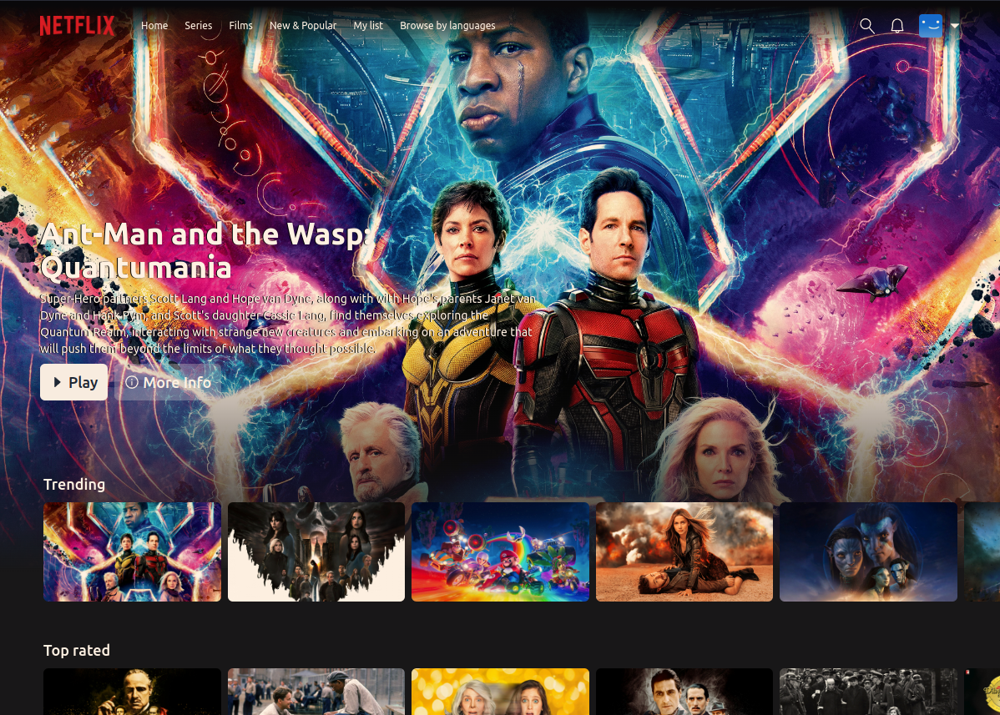

# About
This project is a clone of Netflix, built with **React**, **Next.js**, **Tailwind CSS** and **TypeScript**. The backend is provided by **Firebase**. The movie and TV show titles, descriptions, and images displayed on this webpage are sourced from the **TMDB (The Movie Database) API**. 

## Features
Currently available features: 
- Image optimization
- Infinite movie row scroll
- API Key protection
- TMDB api conection
- User registration
- Login functionality
- Route protection
- Create profiles
- Delete profiles
- Edit profiles

# Live Version
This project is also deployed on Vercel, a cloud platform for static sites and serverless functions. You can visit the live version of this project at **https://netflix-clone-amafoas.vercel.app/**.

# Setting up the project
First of all, you'll need to set your .env.local, so it looks like this
```
TMDB_API_KEY=
NEXT_PUBLIC_FIREBASE_API_KEY=
NEXT_PUBLIC_FIREBASE_AUTH_DOMAIN=
NEXT_PUBLIC_FIREBASE_PROJECT_ID=
NEXT_PUBLIC_FIREBASE_STORAGE_BUCKET=
NEXT_PUBLIC_FIREBASE_MESSAGING_SENDER_ID=
NEXT_PUBLIC_FIREBASE_APP_ID=
```

## Running the project
After that in the root folder of the project, run the following command to install the project dependencies:

```bash
npm install
```
Once the dependencies are installed, you can start the project with the following command:

```bash
npm run dev
```
This will start the Next.js development server, and you can view the page in your browser by going to **http://localhost:3000**.
